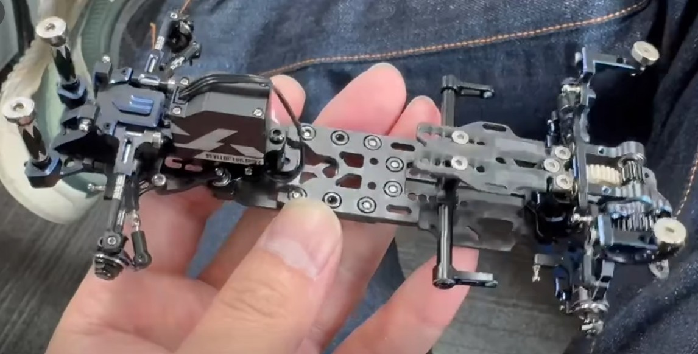
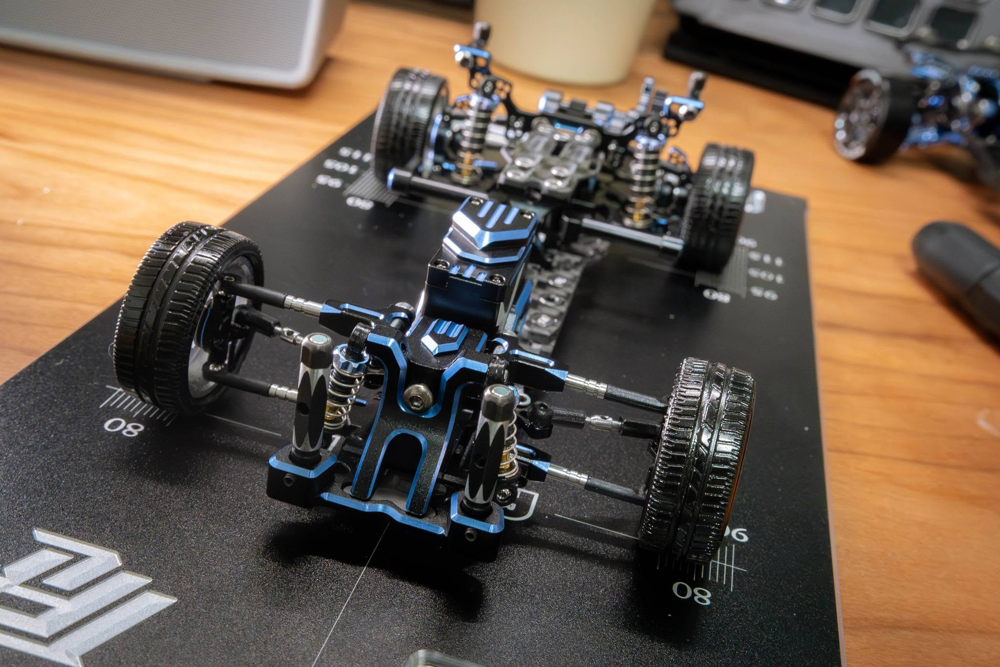
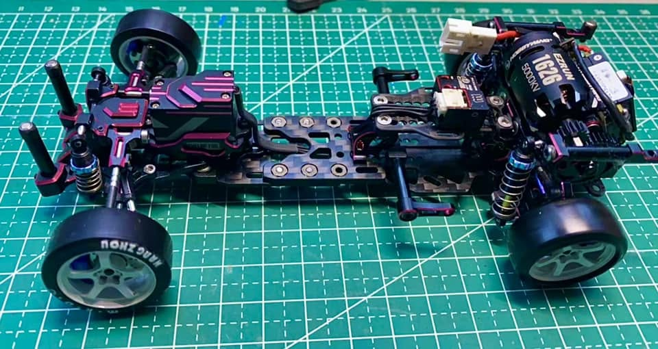

# TRC Meta X

{ width="500" }

## Quick facts

- **Developed by:** *Tommy RC*

- **Release:** *July 2024*

- **Origin:** *China*

- **Status:** *Discontinued*

- **Production:** *Batch*

- **Scale:** *1/24*

- **Body mounting:** *Magnet mounting*

- **Materials:** *Aluminum, carbon fiber*

---

## Adjustability

### At-a-glance

- **Wheelbase:** ✅

- **Camber:** Front ✅ / Rear ✅

- **Toe:** Front ✅ / Rear ❌ (✅ 0° or 4° choice with option part)

- **Caster:** ✅

- **Ackermann quick adjustment:** ✅

- **Ride height:** Front ✅ / Rear ✅

- **Track width:** Front ✅ / Rear ✅ (may require longer cvd dogbones)

- **Front shocks:** preload ✅ / angle ✅

- **Rear shocks:** preload ✅ / angle ✅

- **Active systems:** ❌

- **Motor position:** mid ✅ / high ✅ / rear ✅

- **Servo position:** ✅

- **Pinion-Spur distance:** ✅

- **Front knuckle KPI hinge point:** ❌

- **Front knuckle steering linkage hinge point:** ❌

- **Steering rack linkage hinge point:** ❌ (not confirmed)

### Details

- **Wheelbase adjustment method:** *slider & steps*

- **Wheelbase range:** *94–120 mm*

- **Track width range:** *72–90 mm*

- **Caster adjustment:** *shims*

- **Ackermann adjustment:** *stepless*

- **Rear toe behavior:** *static*

---

## Drivetrain

- **Gearbox type:** *gear-driven*

- **Motor orientation:** *transverse*

- **Forces:** *anti-torque*

- **Reversible:** ✅

- **Differential:** *spool*

---

## Steering

- **Steering method:** *direct*

- **Servo position:** *bulkhead mounted / upper deck / lower deck*

---

## Suspension

- **Front:** *double wishbone, independent, 2 shocks*

- **Rear:** *multi-link, independent, 2 shocks*

- **Shocks type:** *friction shocks*

## Notes

One of the design focuses was to make the car lightweight.

An interesting feature is the spring-loaded servo mount, which allows precise Ackermann adjustment via a screw.

The optional floating gearbox is another interesting feature, which allows the motor pinion and spur gear mesh to self-adjust.

According to Yuan Hao, Tommy RC noted that plastic shocks are smoother than the metal ones, so if you want to upgrade, think of it as a visual upgrade rather than a performance upgrade.

I will also quote Yuan Hao: "The main gear is made from PEEK—a high-end material that’s lightweight, durable, and self-lubricating. Fun fact: PEEK is way more expensive than aluminum, so skip the black aluminum main gear—it’s not worth the downgrade! The PEEK gear runs so quietly, it’s almost on par with belt-driven chassis."

Meta X was available in Pro and Max versions. A very limited Pink Edition, reportedly produced in fewer than 20 units, was released exclusively during MRDC events in China.

Some customers reported QC-related issues and felt that certain design choices were made with cost reduction in mind. However, most of these concerns did not appear to affect the car's performance. 

**MetaX PRO** 

{ width="500" }

**MetaX MAX**

{ width="500" }

**Meta X Pink**

{ width="500" }

---

## Contribute

Have extra info or experience with this chassis? [Contribute here](../../contribute/contribute.md)

---

## Sources / credits / reviews

Yuan Hao, TC Emre Yurdakul, Tommy RC, Jack Nares.

