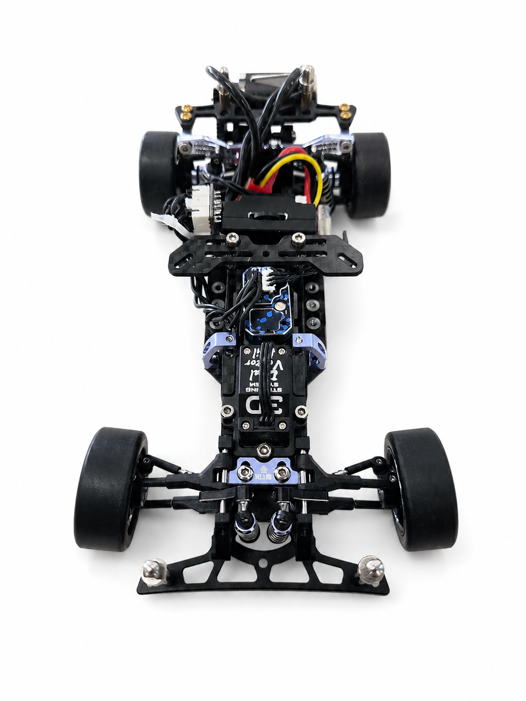
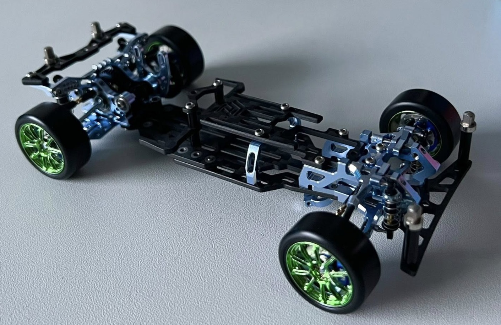
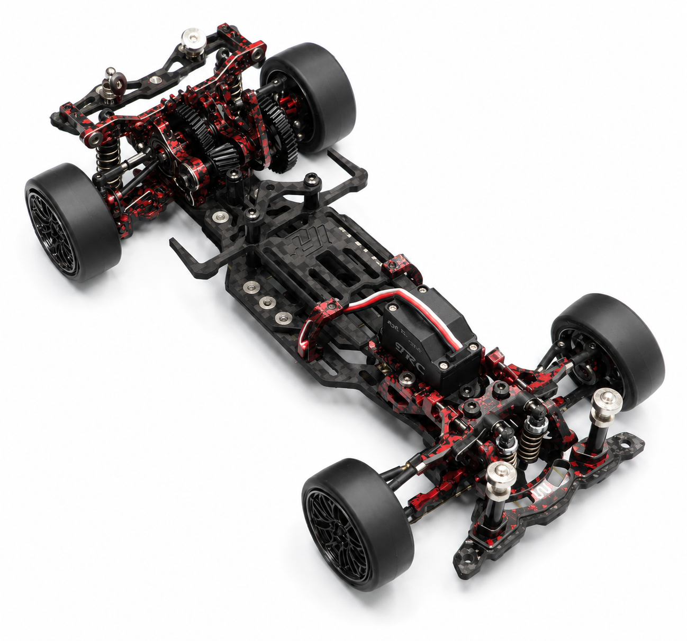
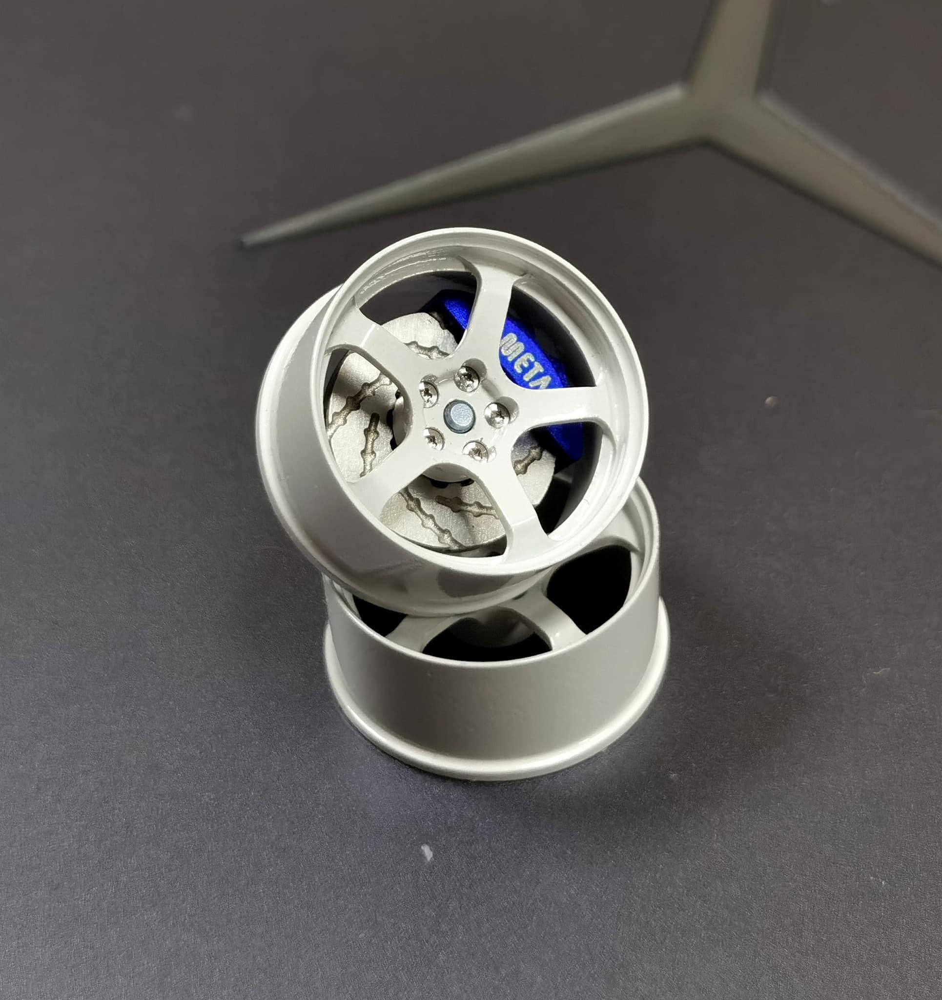

# TRC META

{ width="500" }

## Quick facts

- **Developed by:** *Tommy RC*

- **Release:** *October 2022*

- **Origin:** *China*

- **Status:** *Discontinued*

- **Production:** *Batch*

- **Scale:** *1/24*

- **Body mounting:** *Magnet mounting*

- **Materials:** *Carbon fiber, aluminum, injection molded plastic*

---

## Adjustability

### At-a-glance

- **Wheelbase:** ✅

- **Camber:** Front ✅ / Rear ✅

- **Toe:** Front ✅ / Rear ✅

- **Caster:** ✅

- **Ackermann quick adjustment:** ✅

- **Ride height:** Front ✅ / Rear ✅ 

- **Track width:** Front ✅  / Rear ✅ (Upgrade arms)

- **Front shocks:** preload ✅ / angle ✅

- **Rear shocks:** preload ✅ / angle ✅

- **Active systems:** ❌

- **Motor position:** mid ✅ / high ✅ / rear ✅

- **Servo position:** ✅

- **Pinion-Spur distance:** ✅

- **Front knuckle KPI hinge point:** ❌ (✅ OP knuckle)

- **Front knuckle steering linkage hinge point:** ❌ (✅ OP knuckle)

- **Steering rack linkage hinge point:** ✅

### Details

- **Wheelbase adjustment method:** *slider*

- **Wheelbase range:** *90–120 mm*

- **Track width range:** *60-66 mm(measured without wheels)*

- **Caster adjustment:** *stepless*

- **Ackermann adjustment:** *stepless*

- **Rear toe behavior:** *static*

---

## Drivetrain

- **Gearbox type:** *gear-driven (OP helical gears)*

- **Motor orientation:** *transverse*

- **Forces:** *anti-torque*

- **Reversible:** ✅

- **Differential:** *spool*

---

## Steering

- **Steering method:** *direct*

- **Servo position:** *bulkhead mounted*

---

## Suspension

- **Front:** *double wishbone, independent, 2 shocks*

- **Rear:** *double wishbone, independent, 2 shocks*

- **Shocks type:** *friction shocks*

## Notes

The META was one of the more feature-rich chassis of its time, offering a wide adjustment range together with a large ecosystem of optional parts and upgrades.

Notable optional upgrades included aluminum suspension components, aluminum transmission gears and helical gear sets designed to reduce drivetrain noise and improve smoothness. parts

One of the more practical design details was the rear shock tower, which incorporated integrated cable-routing cutouts to help manage motor wires and keep the chassis layout tidy.

{ width="500" }

*Red-and-black special edition version limited to 100 units*

{ width="500" }

*Another distinctive feature was the proprietary TRC META 5-bolt wheel system, designed to replicate the appearance of real automotive hubs and vented brake discs*

{ width="500" }

---

## Contribute

Have extra info or experience with this chassis? [Contribute here](../../contribute/contribute.md)

---

## Sources / credits / reviews

