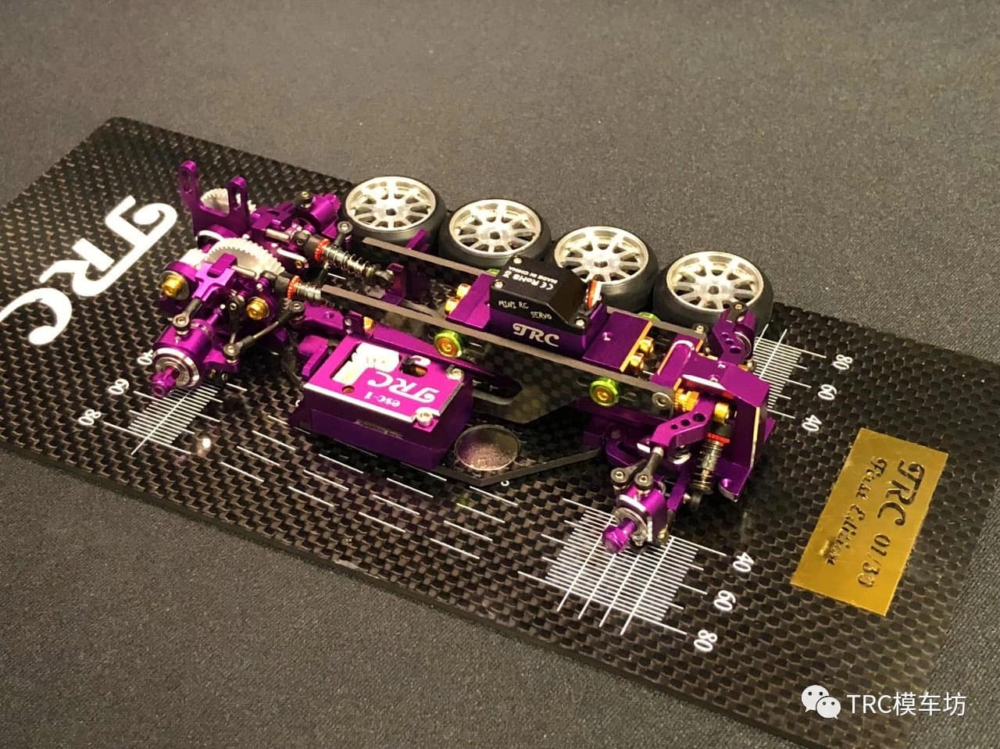
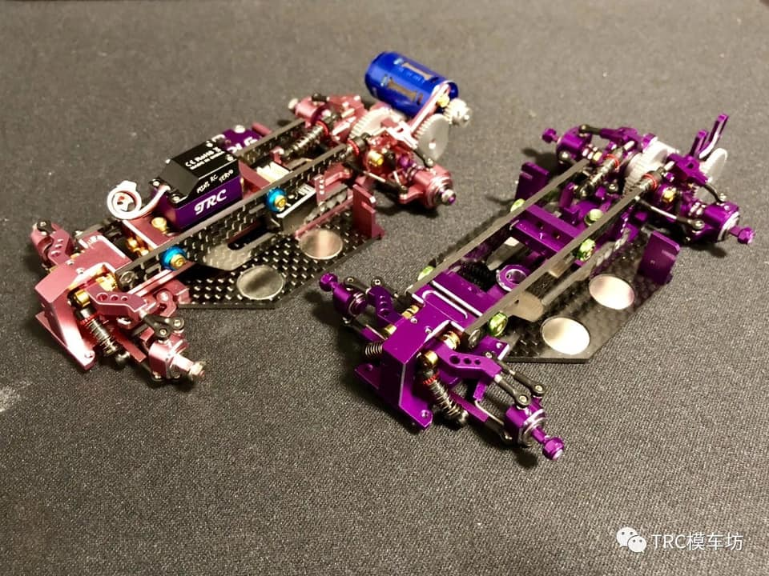
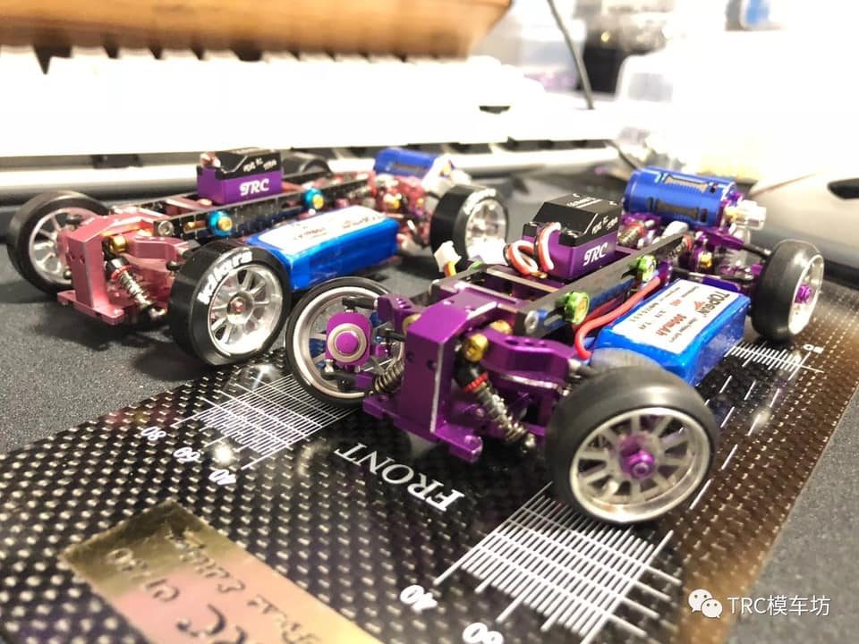

# TRC

{ width="500" }

## Quick facts

- **Developed by:** *Tommy RC*

- **Release:** *November 2019*

- **Origin:** *China*

- **Status:** *Unicorn (discontinued)*

- **Production:** *Limited edition - only 30 kits were ever made*

- **Scale:** *1/28-1/24*

- **Body mounting:** *Holes for magnetic posts / Kyosho MINI-Z*

- **Materials:** *Anodized aluminum, carbon fiber, magnets, stainless steel, injection molded plastic*

---

## Adjustability

### At-a-glance

- **Wheelbase:** ✅

- **Camber:** Front ✅ / Rear ✅

- **Toe:** Front ✅ / Rear ✅

- **Caster:** Not confirmed(looks like it's adjustable with spacers)

- **Ackermann quick adjustment:** ✅

- **Ride height:** Front ✅ / Rear ✅ 

- **Track width:** Front ✅ / Rear ✅ 

- **Front shocks:** Preload ✅  / Angle (not confirmed)

- **Rear shocks:** Preload ✅  / Angle ✅ 

- **Active systems:** ✅ Active front caster and dynamic rear toe / steering

- **Motor position:** mid ❌ / high ✅ / rear ✅

- **Servo position:** ✅

- **Pinion-Spur distance:** ✅ 

- **Front knuckle KPI hinge point:** ✅

- **Front knuckle steering linkage hinge point:** ❌

- **Steering rack linkage hinge point:** ✅

### Details

- **Wheelbase adjustment method:** *steps*

- **Wheelbase range:** *90–120 mm*

- **Track width range:** *??–?? mm*

- **Caster adjustment:** *not confirmed*

- **Ackermann adjustment:** *stepless*

- **Rear toe behavior:** *adjustable dynamic / four wheel steering*

---

## Drivetrain

- **Gearbox type:** *gear-driven(stainless steel gears)*

- **Motor orientation:** *transverse*

- **Forces:** *anti-torque*

- **Reversible:** ❌

- **Differential:** *spool*

---

## Steering

- **Steering method:** *direct*

- **Steering system:** *four wheel steering available*

- **Servo position:** *upper deck*

---

## Suspension

- **Front:** *double wishbone, independent, 2 shocks*

- **Rear:** *multi-link, independent, 2 shocks*

- **Shocks type:** *friction shocks(unconfirmed information that oil-filled shocks were used, but according to available images, the shocks we can see are exactly the same, used at Orlandoo Hunter)*

## Notes

Limited number labeled chassis plate and setup board from 01/30 to 30/30

{ width="500" }

15 of them were anodized in pink, the other 15 in purple

{ width="500" }

{ width="500" }

---

## Contribute

Have extra info or experience with this chassis? [Contribute here](../../contribute/contribute.md)

---

## Sources / credits / reviews

