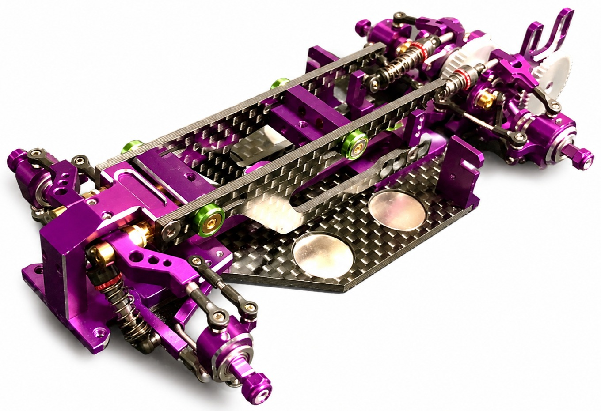
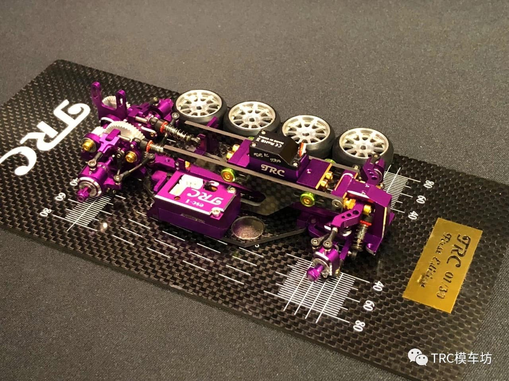
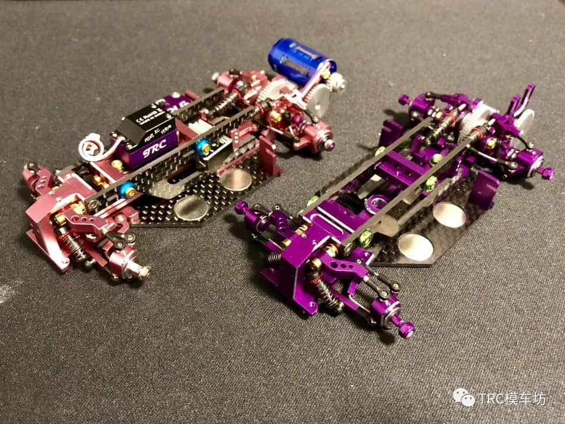
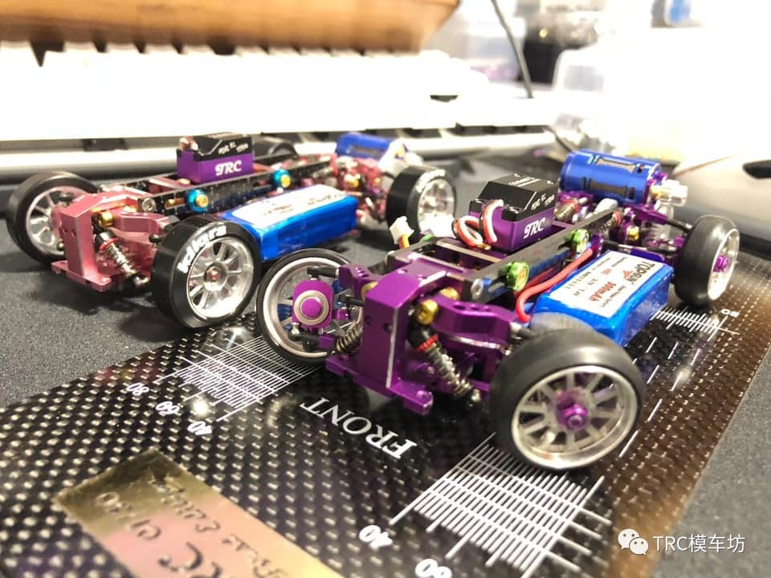

# TRC

{ width="500" }

## Quick facts

- **Developed by:** *Tommy RC*

- **Release:** *November 2019*

- **Origin:** *China*

- **Status:** *Discontinued*

- **Production:** *Limited edition - only 30 kits were ever made*

- **Scale:** *1/28-1/24*

- **Body mounting:** *Holes for magnetic posts / Kyosho MINI-Z*

- **Materials:** *Anodized aluminum, carbon fiber, magnets, stainless steel, injection molded plastic*

---

## Adjustability

### At-a-glance

- **Wheelbase:** ✅

- **Track width:** Front ✅ / Rear ✅

- **Camber:** Front ✅ / Rear ✅

- **Camber gain:** Front ❌ / Rear ❌

- **Caster:** ✅ Not confirmed(looks like it's adjustable with spacers)

- **Ackermann quick adjustment:** ✅

- **Toe:** Front ✅ / Rear ✅

- **Ride height:** Front ✅ / Rear ✅  

- **Front shocks:** Preload ✅  / Angle ✅(not confirmed)

- **Rear shocks:** Preload ✅  / Angle ✅ 

- **Active systems:** ✅ Active front caster and dynamic rear toe / steering

- **Motor position:** mid ❌ / high ✅ / rear ✅

- **Belt tension/Pinion size:** ✅

- **Extendable dogbones:** ❌ (not confirmed)

- **Front knuckle KPI:** ✅

- **Steering linkage position on knuckle:** ❌

- **Steering rack linkage position:** ✅

### Details

- **Wheelbase adjustment method:** *steps*

- **Wheelbase range:** *90–120 mm*

- **Track width range:** *??–?? mm*

- **Caster adjustment:** *shims(not confirmed)*

- **Ackermann adjustment:** *stepless*

- **Rear toe behavior:** *adjustable dynamic / four wheel steering*

---

## Drivetrain

- **Gearbox type:** *gear-driven(stainless steel gears)*

- **Motor orientation:** *transverse*

- **Forces:** *anti-torque*

- **Reversible:** ❌

- **Differential:** *spool*

---

## Steering

- **Steering method:** *direct*

- **Steering system:** *four wheel steering available*

---

## Suspension

- **Front:** *double wishbone, independent, 2 shocks*

- **Rear:** *multi-link, independent, 2 shocks*

- **Shocks type:** *friction shocks(unconfirmed information that oil-filled shocks were used, but according to available images, the shocks we can see are exactly the same, used at Orlandoo Hunter)*

## Community ratings

## History & Development

When the TRC was introduced in late 2019, most RWD drift chassis still followed relatively conventional suspension and steering layouts. Rather than refining existing concepts, Tommy RC focused on introducing several advanced engineering solutions that were almost unheard of at the time.

The chassis introduced active caster geometry, adjustable dynamic rear toe with optional four-wheel steering, adjustable KPI and a highly configurable suspension layout. Even by today's standards, this remains one of the most mechanically sophisticated RWD drift chassis from the hobby's early years.

Each kit included a numbered chassis plate and matching setup board, with only 30 sets produced (01/30–30/30).

{ width="500" }

15 of them were anodized in pink, the other 15 in purple.

{ width="500" }

{ width="500" }

TRC first gained attention among the international community through images shared by Mikos (DriftaHolics RC). The limited production run sold out almost immediately, and only a handful of enthusiasts outside China ever managed to acquire one on the used market.
Many of the ideas explored on the original TRC would later become more common on high-end drift chassis. Tommy RC continued pushing the concept further with the even more ambitious [TRC v2](../trc2/page.md).  

---

## Contribute

Have extra info or experience with this chassis? [Contribute here](../../../contribute/contribute.md)

---

## Sources / credits / reviews
TC Emre Yurdakul, DriftaHolics RC, ChanRC, Mohamed Ali Farah

