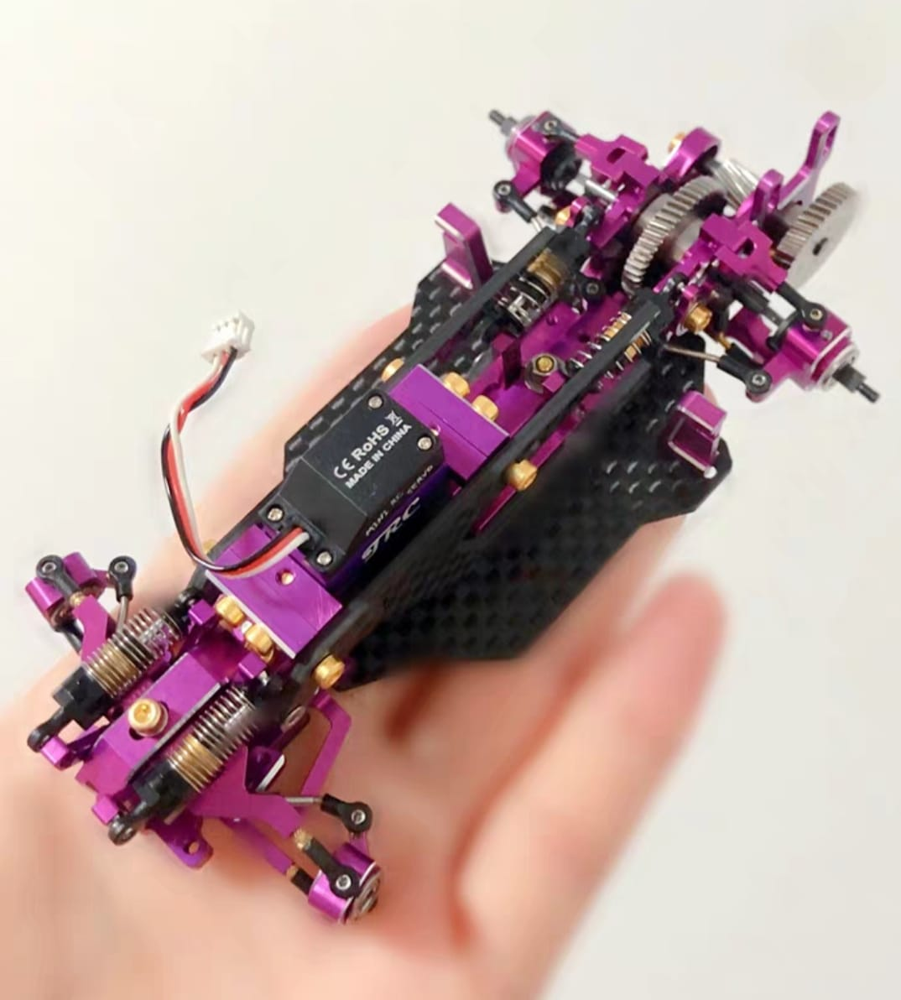
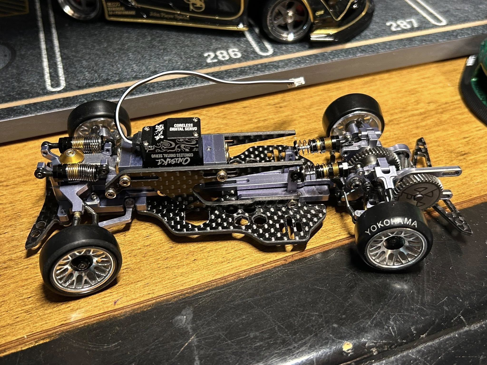

# TRC V2

{ width="500" }

## Quick facts

- **Developed by:** *Tommy RC*

- **Release:** *July 2020*

- **Origin:** *China*

- **Status:** *Legendary (Discontinued)*

- **Production:** *Batch*

- **Scale:** *1/28-1/24*

- **Body mounting:** *Magnet mounting / Kyosho MINI-Z*

- **Materials:** *7075 anodized aluminum, carbon fiber, stainless steel, injection molded plastic*

---

## Adjustability

### At-a-glance

- **Wheelbase:** ✅

- **Camber:** Front ✅ / Rear ✅

- **Toe:** Front ✅ / Rear ✅

- **Caster:** ✅

- **Ackermann quick adjustment:** ✅

- **Ride height:** Front ✅ / Rear ✅

- **Track width:** Front ✅ / Rear ✅

- **Front shocks:** Preload ✅ / Angle ❌

- **Rear shocks:** Preload ✅ / Angle ✅

- **Active systems:** ✅ (Active front caster and 4 wheel steering)

- **Motor position:** mid ❌ / high ✅  / rear ✅

- **Servo position:** ✅

- **Pinion-Spur distance:** ✅

- **Front knuckle KPI hinge point:** ✅

- **Front knuckle steering linkage hinge point:** ❌

- **Steering rack linkage hinge point:** ✅

- **Telescopic CVD dogbones** ✅

### Details

- **Wheelbase adjustment method:** *steps*

- **Wheelbase range:** *90–120 mm*

- **Track width range:** *??–?? mm*

- **Caster adjustment:** *stepless*

- **Ackermann adjustment:** *stepless*

- **Rear toe behavior:** *adjustable dynamic toe / toe-steer*

---

## Drivetrain

- **Gearbox type:** *gear-driven(stainless steel helical gears)*

- **Motor orientation:** *transverse*

- **Forces:** *anti-torque*

- **Reversible:** ❌

- **Differential:** *spool*

---

## Steering

- **Steering method:** *direct*

- **Steering system:** *four wheel steering available*

- **Servo position:** *upper deck*

---

## Suspension

- **Front:** *double wishbone, independent, 2 cantilever shocks*

- **Rear:** *multi-link, independent, 2 cantilever shocks*

- **Shocks type:** *oil filled shocks*

## Notes

**Available optional parts:**

- aluminum brake discs and calipers
- deep dish style 20mm wheels   
- chassis plates

**Extra images:**

{ width="500" }
{ width="500" }

---

## Contribute

Have extra info or experience with this chassis? [Contribute here](../../contribute/contribute.md)

---

## Sources / credits / reviews

