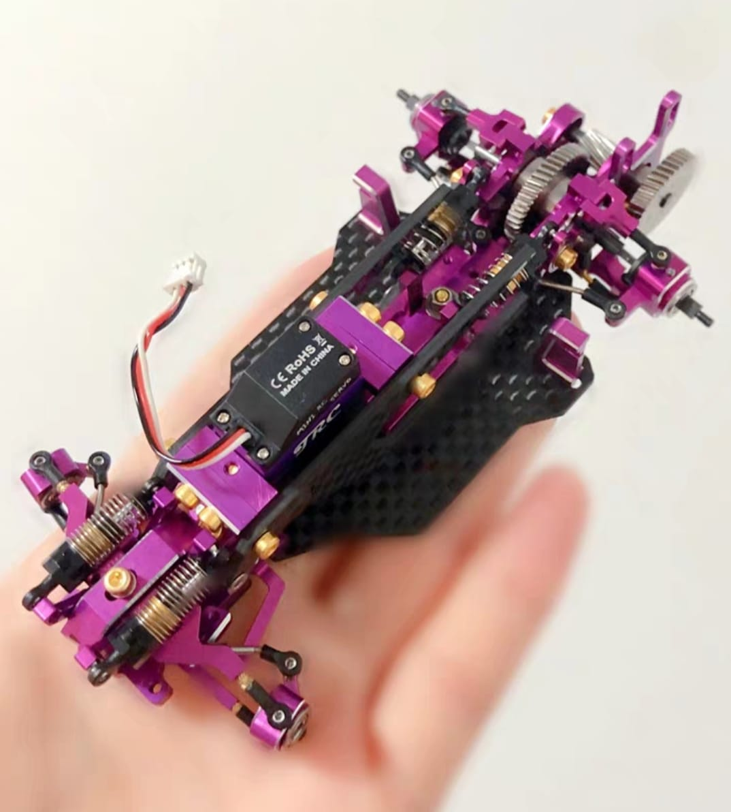
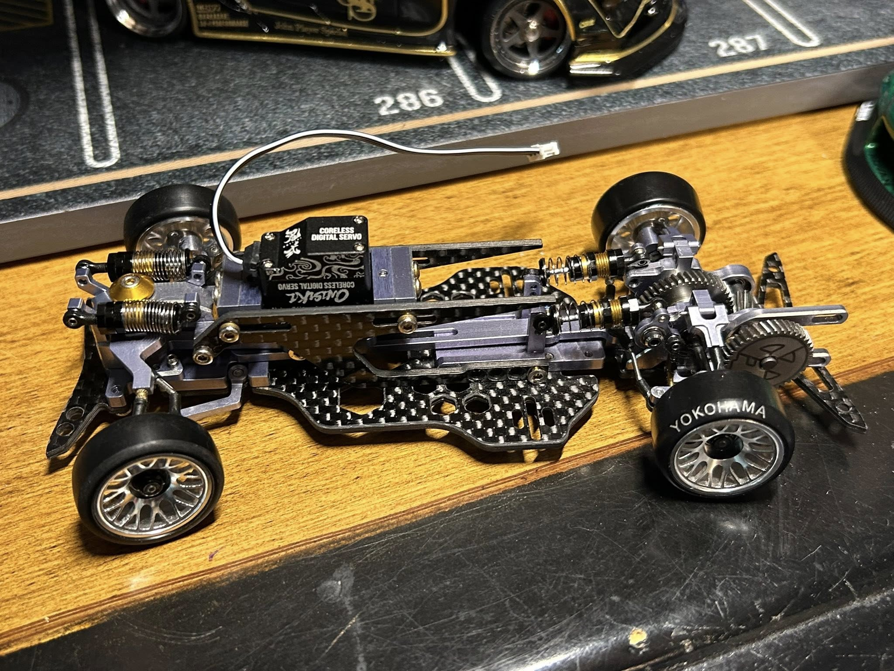

# TRC V2

{ width="500" }

## Quick facts

- **Developed by:** *Tommy RC*

- **Release:** *July 2020*

- **Origin:** *China*

- **Status:** *Discontinued*

- **Production:** *Batch*

- **Scale:** *1/28-1/24*

- **Body mounting:** *Magnet mounting / Kyosho MINI-Z*

- **Materials:** *7075 anodized aluminum, carbon fiber, stainless steel, injection molded plastic*

---

## Adjustability

### At-a-glance

- **Wheelbase:** ✅

- **Track width:** Front ✅ / Rear ✅

- **Camber:** Front ✅ / Rear ✅

- **Camber gain:** Front ❌ / Rear ❌

- **Caster:** ✅

- **Ackermann quick adjustment:** ✅

- **Toe:** Front ✅ / Rear ✅

- **Ride height:** Front ✅ / Rear ✅

- **Front shocks:** Preload ✅ / Angle ❌

- **Rear shocks:** Preload ✅ / Angle ✅

- **Active systems:** ✅ (Active front caster and 4 wheel steering)

- **Motor position:** mid ❌ / high ✅  / rear ✅

- **Belt tension/Pinion size:** ✅

- **Extendable dogbones:** ✅

- **Front knuckle KPI:** ✅

- **Steering linkage position on knuckle:** ❌

- **Steering rack linkage position:** ✅

### Details

- **Wheelbase adjustment method:** *steps*

- **Wheelbase range:** *90–120 mm*

- **Track width range:** *??–?? mm*

- **Caster adjustment:** *stepless*

- **Ackermann adjustment:** *stepless*

- **Rear toe behavior:** *adjustable dynamic toe / toe-steer*

---

## Drivetrain

- **Gearbox type:** *gear-driven(stainless steel helical gears)*

- **Motor orientation:** *transverse*

- **Forces:** *anti-torque*

- **Reversible:** ❌

- **Differential:** *spool*

---

## Steering

- **Steering method:** *direct*

- **Steering system:** *four wheel steering available*

- **Servo position:** *upper deck*

---

## Suspension

- **Front:** *double wishbone, independent, 2 cantilever shocks*

- **Rear:** *multi-link, independent, 2 cantilever shocks*

- **Shocks type:** *oil filled shocks*

## Community ratings

## History & Development

When Tommy RC introduced the TRC V2, the goal was not to replace the original concept but to refine it further. Building on the advanced geometry of the first-generation TRC, the second version retained features such as active caster, adjustable KPI, dynamic rear toe and optional four-wheel steering while introducing several major mechanical improvements.

The most significant change was the completely redesigned cantilever suspension, using longitudinal oil-filled dampers at both the front and rear. Together with a new helical gear transmission and stepless caster adjustment, these revisions made the chassis both mechanically more sophisticated while also offering finer suspension tuning.

Unlike the original TRC, which was limited to only 30 numbered kits, the TRC V2 was produced in a larger limited run consisting of 50 blue and 150 purple chassis, making it considerably more attainable while still remaining one of the rarest early-generation high-end RWD drift platforms.

Many of the engineering ideas introduced on the TRC series would later appear on other premium small-scale drift chassis, particularly advanced suspension geometry, active systems and increasingly configurable front-end design.

**TRC V2 Purple**

{ width="500" }

**TRC V2 Blue**

{ width="500" }

**Notable optional parts:**

- aluminum brake discs and calipers
- deep dish style 20mm wheels   
- chassis plates
  
---

## Contribute

Have extra info or experience with this chassis? [Contribute here](../../../contribute/contribute.md)

---

## Sources / credits / reviews

TC Emre Yurdakul, Toby Evans, John Stangle, Chris Tronic, Dee Kühl

