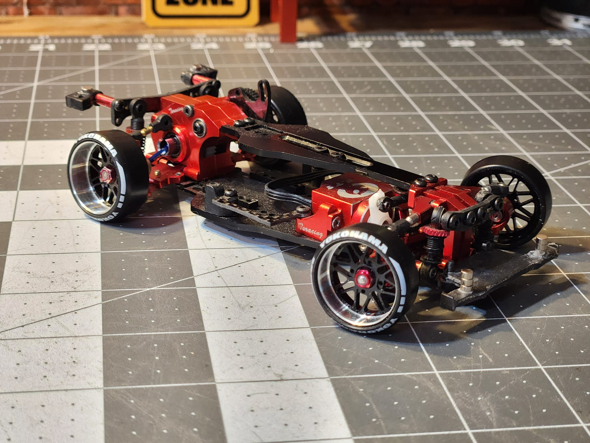
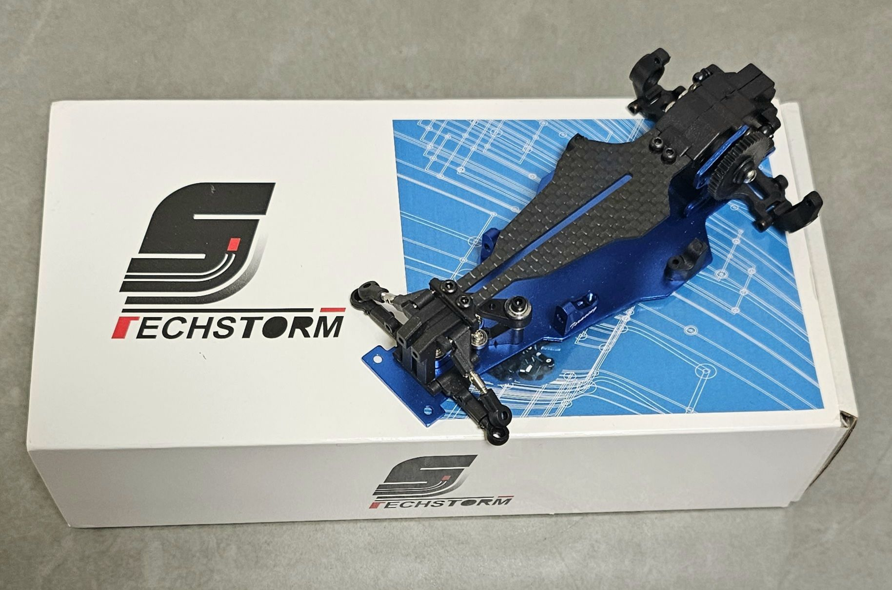

# Techstorm XRX DPA Sport

{ width="500" }

## Quick facts

- **Developed by:** *Techstorm Racing*

- **Release:** *July 2019*

- **Origin:** *Hongkong*

- **Status:** *Available(2026 re-release)*

- **Production:** *Mass*

- **Scale:** *1/28(1/24 with upgrades)*

- **Body mounting:** *Kyosho(Magnet mounting with upgrade)*

- **Materials:** *Injection molded plastic, stainless steel,aluminum carbon fiber and updates from brass, nylon and aluminum*

---

## Adjustability

### At-a-glance

- **Wheelbase:** ❌(✅ with optional upgrade)

- **Camber:** Front ✅ / Rear ✅

- **Toe:** Front ✅ / Rear ❌(✅ with optional upgrade)

- **Caster:** ✅

- **Ackermann quick adjustment:** ❌

- **Ride height:** Front ✅ / Rear ✅

- **Track width:** Front ✅ / Rear ❌(✅ with optional upgrades)

- **Front shocks:** preload ✅ / angle ✅

- **Rear shocks:** preload ✅ / angle ✅

- **Active systems:** ❌

- **Motor position:** mid ✅ / high ✅ / rear ❌

- **Servo position:** ❌

- **Pinion-Spur distance:** ✅

- **Front knuckle KPI hinge point:** ❌

- **Front knuckle steering linkage hinge point:** ❌

- **Steering rack linkage hinge point:** ✅

### Details

- **Wheelbase adjustment method:** *fixed WB (steps/slider with op plate)*

- **Wheelbase range:** *fixed 94mm(90mm-120mm with optional chassis plate)*
 
- **Track width range:** *70-?? mm*

- **Caster adjustment:** *shims*

- **Ackermann adjustment:** *Changing position of ballheads on the steering rack and adjusting links length*

- **Rear toe behavior:** *static*

**Important upgrade parts:**

- 90-120mm Aluminum and carbon fiber chassis plates
- rear toe blocks
- rear adjustable width lower arms and longer cvd dogbones 
- aluminum replacement parts
- magnetic body mount system

---

## Drivetrain

- **Gearbox type:** *gear-driven*

- **Motor orientation:** *transverse*

- **Forces:** *anti-torque*

- **Reversible:** ❌

- **Differential:** *spool / ball diff(option part)*

---

## Steering

- **Steering method:** *pivoted*

- **Steering system:** *slide rack*

- **Servo position:** *lower deck*

---

## Suspension

- **Front:** *double wishbone, independent, 2 shocks*

- **Rear:** *multi-link, independent, 2 shocks*

- **Shocks type:** *friction shocks*

## Notes

**May 2019 XRX DPA was introduced** 

{ width="500" }

Information from Facebook posts, before first version states that it comes with:
- fixed 94mm wheelbase, with option plate for 98mm wheelbase
- ball differential(maybe only as optional part)
- it is currently unclear whether this early DPA configuration was publicly available as a retail product, or if DPA Sport marked the first official public release

---

**Limited edition red anodized aluminum XRX DPA**

Unconfirmed information states that only 100 units of the red version were ever made.

---

**2026 XRX DPA re-release**

---

## Contribute

Have extra info or experience with this chassis? [Contribute here](../../contribute/contribute.md)

---

## Sources / credits / reviews

