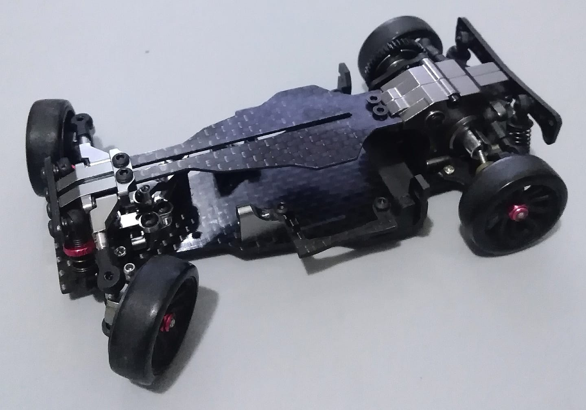
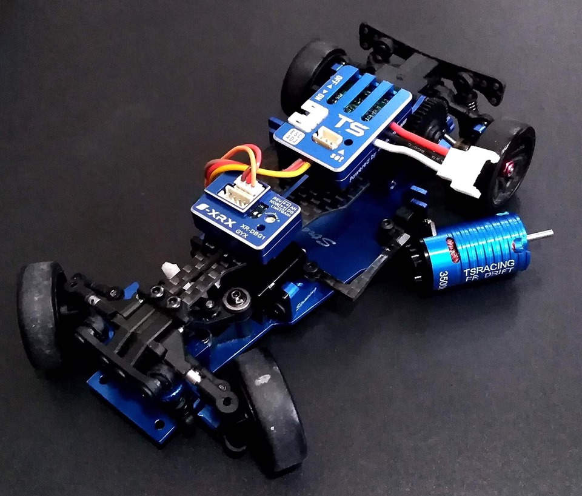
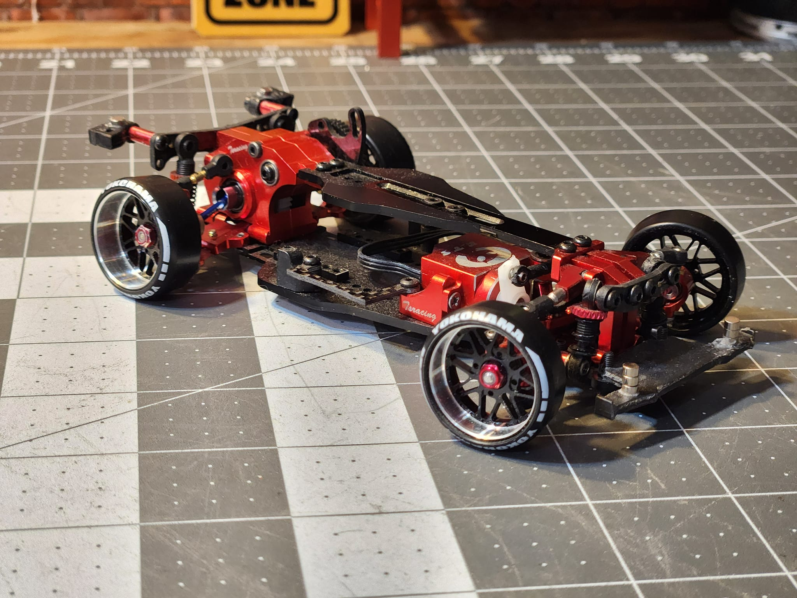
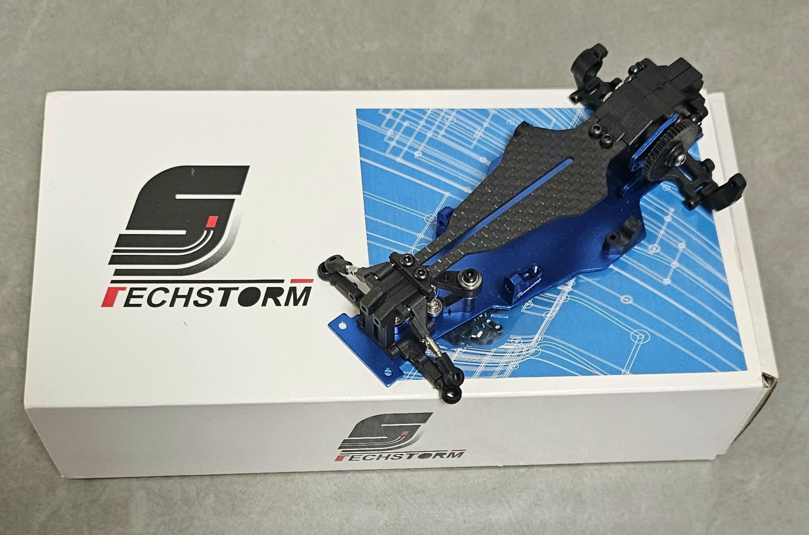

# Techstorm XRX DPA

{ width="500" }

## Quick facts

- **Developed by:** *Techstorm Racing*

- **Release:** *Мarch 2019*

- **Origin:** *Hongkong*

- **Status:** *Available(2026 re-release)*

- **Production:** *Mass*

- **Scale:** *1/28(1/24 with upgrades)*

- **Body mounting:** *Kyosho(Magnet mounting with upgrade)*

- **Materials:** *Injection molded plastic, stainless steel,aluminum carbon fiber and updates from brass, nylon and aluminum depending on the version and options*

---

## Adjustability

### At-a-glance

- **Wheelbase:** ❌(✅ with optional upgrade)

- **Track width:** Front ✅ / Rear ❌(✅ with optional upgrades)

- **Camber:** Front ✅ / Rear ✅
  
- **Camber gain:** Front ❌ / Rear ❌

- **Caster:** ✅

- **Ackermann quick adjustment:** ❌

- **Toe:** Front ✅ / Rear ❌(✅ with optional upgrade)

- **Ride height:** Front ✅ / Rear ✅

- **Front shocks:** preload ✅ / angle ✅

- **Rear shocks:** preload ✅ / angle ✅

- **Active systems:** ❌

- **Motor position:** mid ✅ / high ✅ / rear ❌

- **Belt tension/Pinion size:** ✅

- **Extendable dogbones:** ❌ (✅ different lengths optional)

- **Servo position:** ❌

- **Front knuckle KPI:** ❌

- **Steering linkage position on knuckle:** ❌

- **Steering rack linkage position:** ✅

### Details

- **Wheelbase adjustment method:** *fixed WB (steps/slider with op plate)*

- **Wheelbase range:** *fixed 90/94mm(90mm-120mm with optional chassis plate)*
 
- **Track width range:** *70-?? mm*

- **Caster adjustment:** *shims*

- **Ackermann adjustment:** *Changing position of ballheads on the steering rack and adjusting links length*

- **Rear toe behavior:** *static*

**Important upgrade parts:**

- 90-120mm Aluminum and carbon fiber chassis plates
- rear toe blocks
- rear adjustable width lower arms and longer cvd dogbones 
- aluminum replacement parts
- magnetic body mount system

---

## Drivetrain

- **Gearbox type:** *gear-driven*

- **Motor orientation:** *transverse*

- **Forces:** *anti-torque*

- **Reversible:** ❌

- **Differential:** *spool / ball (depending on the version)*

---

## Steering

- **Steering method:** *pivoted*

- **Steering system:** *slide rack*

- **Servo position:** *lower deck*

---

## Suspension

- **Front:** *double wishbone, independent, 2 shocks*

- **Rear:** *multi-link, independent, 2 shocks*

- **Shocks type:** *friction shocks*

## Community ratings

## History & Development

When the XRX DPA MK1 was announced in March 2019, the small-scale RWD drift scene was still in its infancy. At the time, enthusiasts had very few commercially available options beyond the [Atomic DRZ](../atomic/drz/page.md), with the remaining alternatives consisting mostly of independent or 3D printed projects. The DPA gave enthusiasts their first serious commercially available alternative to the Atomic DRZ. The original MK1 was introduced as a premium full-option kit featuring aluminum, carbon fiber and a sliding rack steering system.

A few months later, XRX expanded the lineup with the more affordable DPA Sport. Rather than replacing the original MK1, the Sport introduced plastic components to reduce manufacturing costs and make the platform accessible to a wider audience. While this lowered the entry price, early Sport kits also received criticism for the durability of some plastic parts, prompting XRX to gradually introduce reinforced components and numerous aluminum upgrade options.

Unlike many manufacturers that moved quickly from one chassis generation to the next, XRX continued developing the original DPA platform for several years. The company regularly released runnin production updates, reinforced components, optional aluminum upgrades, adjustable chassis plates and new package variants.

Community opinion remained divided throughout the platform's lifetime. While experienced owners often described the chassis as highly capable once properly tuned, many beginners struggled with its setup-sensitive nature. The early Sport version also received criticism for the durability of some plastic parts, aluminum differential cups, steering rack adjustment, the need for careful tuning and lack of wheelbase adjustment. Many of these issues were gradually addressed through later updates and optional parts.

By the time the completely redesigned [DPA2](../xrx-dpa2/page.md) arrived, the original DPA had already evolved through years of incremental refinement. Although eventually replaced as XRX's flagship platform, the company never completely abandoned the design, revisiting it through later editions before bringing it back as the DPA Classic Edition in 2026.

--

**XRX DPA Sport**

{ width="500" }

---

**Limited edition red anodized aluminum XRX DPA**

{ width="500" }

Unconfirmed information states that only 100 units of the red version were ever made.

---

**2026 XRX DPA re-release**

{ width="500" }

---

## Contribute

Have extra info or experience with this chassis? [Contribute here](../../contribute/contribute.md)

---

## Sources / credits / reviews
XRX, DriftaHolics RC, Adolf Oliver Bush

