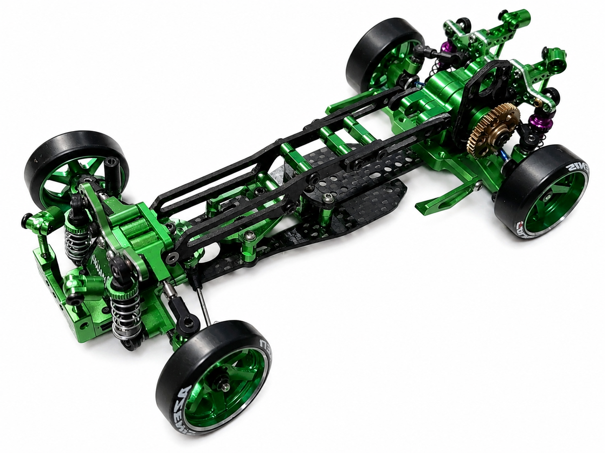
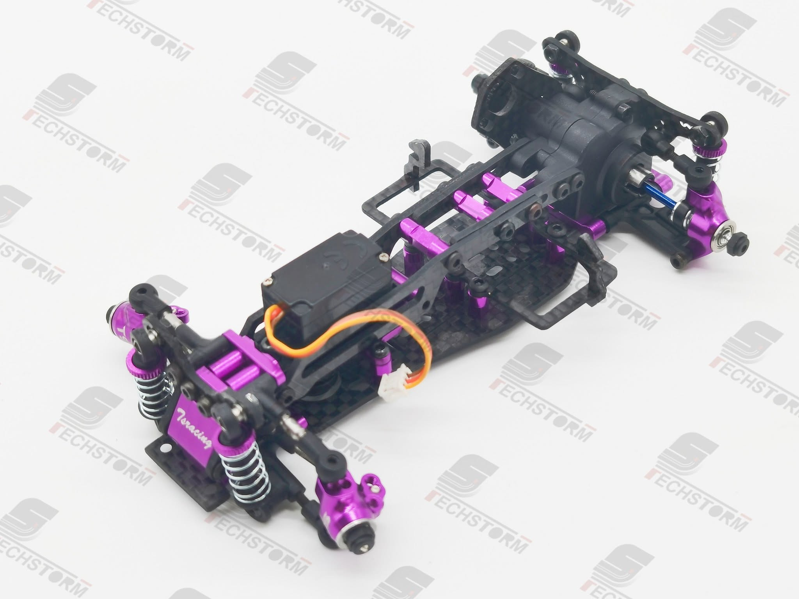

# XRX DPA2

{ width="500" }

## Quick facts

- **Developed by:** *Techstorm Racing*

- **Release:** *October 2022*

- **Origin:** *Hong Kong*

- **Status:** *Discontinued*

- **Production:** *Batch*

- **Scale:** *1/24-1/28*

- **Body mounting:** *Magnet mounting/MINI-Z*

- **Materials:** *Aluminum, carbon fiber, injection molded plastic*

---

## Adjustability

### At-a-glance

- **Wheelbase:** ✅

- **Track width:** Front ✅ / Rear ❌ (✅ with option parts)

- **Camber:** Front ✅ / Rear ✅

- **Camber gain:** Front ❌ / Rear ✅

- **Caster:** ✅

- **Ackermann quick adjustment:** ❌

- **Toe:** Front ✅ / Rear ✅

- **Ride height:** Front ✅ / Rear ✅

- **Front shocks:** preload ✅ / angle ✅

- **Rear shocks:** preload ✅ / angle ✅

- **Active systems:** ❌

- **Motor position:** mid ❌ / high ✅ / rear ❌

- **Belt tension/Pinion size:** ✅

- **Extendable dogbones:** ❌

- **Front knuckle KPI:** ✅

- **Steering linkage position on knuckle:** ✅

- **Steering rack linkage position:** ✅

### Details

- **Wheelbase adjustment method:** *slider / steps*

- **Wheelbase range:** *98–110 mm (94–110 mm on DPA2.1)*

- **Track width range:** *78-?? mm*

- **Caster adjustment:** *shims*

- **Ackermann adjustment:** *ball stud positions / tie-rods length*

- **Rear toe behavior:** *static*

---

## Drivetrain

- **Gearbox type:** *gear-driven*

- **Motor orientation:** *transverse*

- **Forces:** *anti-torque*

- **Reversible:** ❌

- **Differential:** *spool / ball differential (optional)*

---

## Steering

- **Steering method:** *direct*

---

## Suspension

- **Front:** *double wishbone, independent, 2 shocks*

- **Rear:** *double wishbone, independent, 2 shocks*

- **Shocks type:** *friction shocks*

## Community ratings

## History & Development

The DPA2 first surfaced publicly in July 2022, when RC Supremacy began teasing an upcoming collaboration with XRX. The project was presented with unusually high expectations for the still-small micro RWD drift scene, with a September release being targeted and RC Supremacy describing it as one of the most significant upcoming releases of the year.

The chassis arrived later in 2022 as the successor to XRX's original DPA platform. The launch, however, did not live up to all of the anticipation surrounding it. Early owners reported a number of issues, and the DPA2 quickly developed a reputation for having been rushed, although some owners were nevertheless able to achieve very good results with the chassis. XRX responded relatively quickly, introducing the DPA2.1 revision and providing an upgrade package for existing DPA2 owners in November 2022.

The platform was subsequently offered in different specifications, most notably the purple Sport-R and the green GD. The Sport-R represented the more affordable configuration and used a number of moulded components, while the GD used more aluminium parts and was positioned as the higher-specification version. Both shared the same platform and continued to receive revised and optional components over time.

*Sport-R* 

{ width="500" }

After a quieter period, XRX returned to the platform in 2024, declaring that the “DPA is alive” and beginning what it called the “DPA renew project.” The renewed development addressed known weaknesses including the rear CVDs and dampers, and eventually led to further iterations such as the RD25, GD25 and Japan-market JD25. Development was still active in early 2025, when XRX described the DPA2 as the middle model between the entry-level DPA1 and a future DPA3.

---

## Contribute

Have extra info or experience with this chassis? [Contribute here](../../contribute/contribute.md)

---

## Sources / credits / reviews

