# How RWD came to small scale drifting

## 2014 Early experiments – Afada Rioo

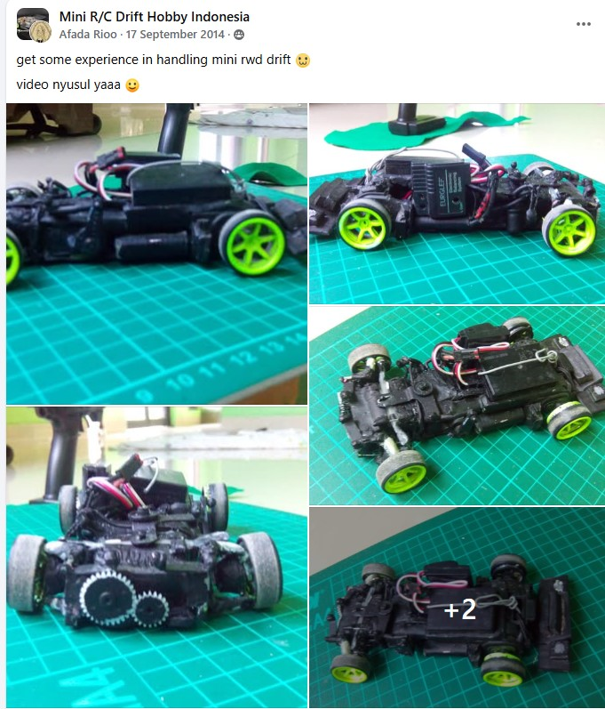{ width="600" }

When I first started asking myself how RWD drifting actually entered the small-scale RC world, the most obvious assumption was Kyosho Mini-Z. The platform had existed for years, so it felt like the logical origin point.

The reality turned out to be very different.

Digging deeper — post by post, year by year — eventually led back to 2014, inside the Facebook group Mini R/C Drift Hobby Indonesia. Almost everything related to RWD drifting in small scale at that time pointed to a single name:

Afada Rioo.

Scrolling through those early posts today, you can still feel the anticipation. The community was waiting for his next update, his next experiment, his next breakthrough. Afada set himself a challenge — and fully committed to solving it.

By modern standards, the results may look crude or unconventional. But context matters. There were no precise nano electronics, no off-the-shelf solutions, no reference builds. Everything had to be invented from scratch.

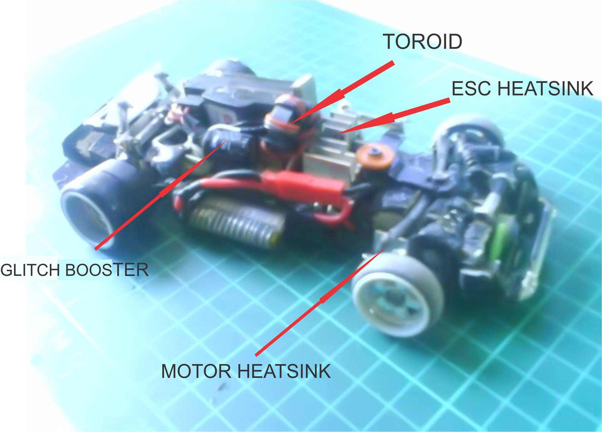{ width="450" }

Some of the solutions he came up with feel almost surreal even now.

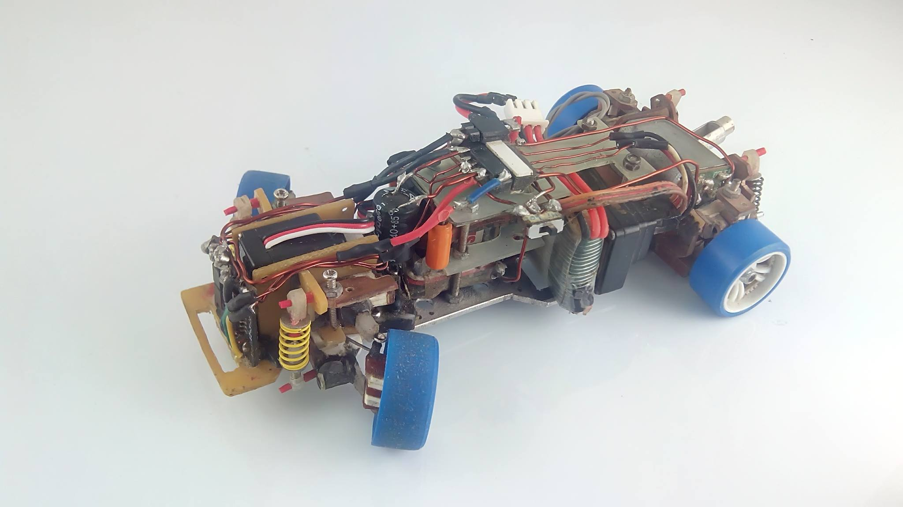{ width="550" }
 
Afada had to learn everything at once — electronics, mechanics, geometry, trial-and-error experimentation. He modified components, rebuilt systems, and continuously adapted ideas that simply didn’t exist in ready-made form at the time.

Looking back, it’s fair to say that Afada Rioo is the grandfather of small-scale RWD drifting. The connection between his early experiments and what exists today is direct — and impossible to ignore.

---

## 2016 Legowo Setiawan and his first K989 conversion 

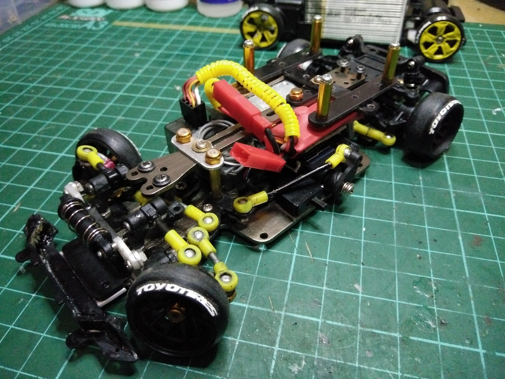{ width="500" }

Legowo Setiawan came from the 1/10 drift world, where he had already spent time studying chassis design, steering geometry, suspension behavior, and tuning philosophy.

In 2015 he decided to apply that knowledge — along with some of Afada Rioo’s discoveries — and began his own RWD project.

The WLToys K989 is a budget “semi-hobby-grade” chassis, yet in 2016, Setiawan managed to turn it into a functional RWD drift platform.

A year later, in 2017, he successfully converted the Atomic AMR into an RWD drifter as well — and this time, it didn’t go unnoticed.

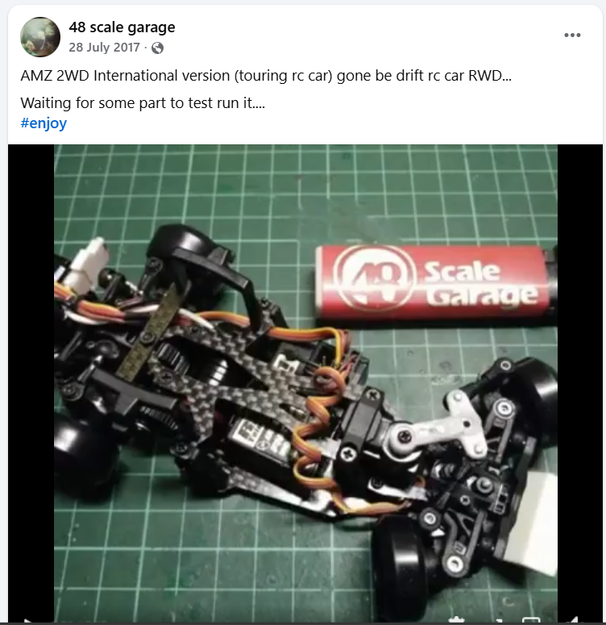{ width="500" }

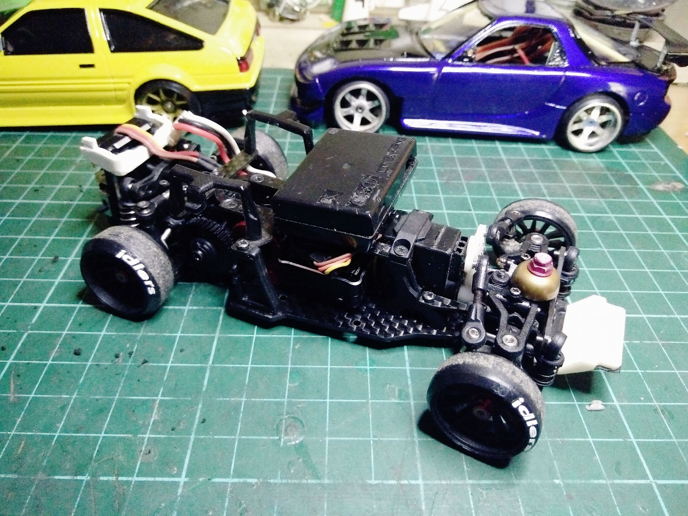{ width="500" }

Let’s return to the importance of Afada Rioo. Look at these two cars side by side — do you recognize the connection?

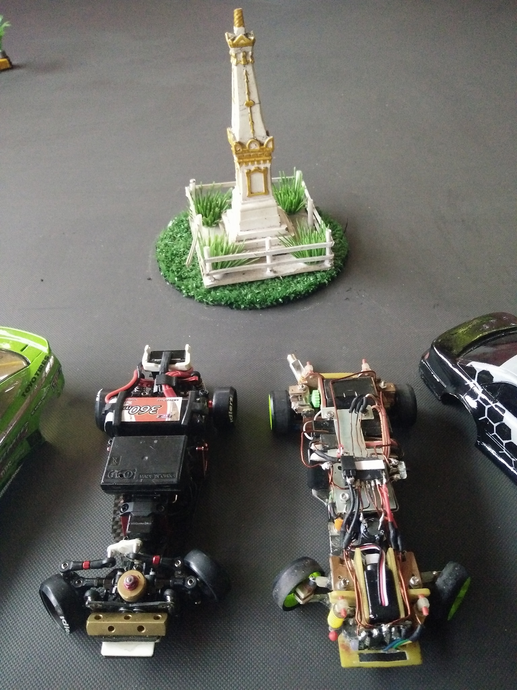{ width="500" }

Legowo’s work caught the attention of Atomic. Their manager, Mr. Kim, initiated development of a dedicated RWD kit based on Legowo’s research.

Two prototypes were built:

- one sent to Atomic

- one kept by Legowo for continued development

According to Legowo, both DRZ1 and DRZ2 were direct results of this collaboration. He later shared that in late 2018 Atomic unilaterally ended the agreement and never responded to his final message.

I also attempted to contact Mr. Kim — without success.

Regardless of how the story ended, one thing remains certain:
Legowo Setiawan and Mr. Kim are responsible for the existence of the first commercial small-scale RWD drift chassis — the Atomic DRZ. 

---

## 2018 Birth of the Atomic DRZ

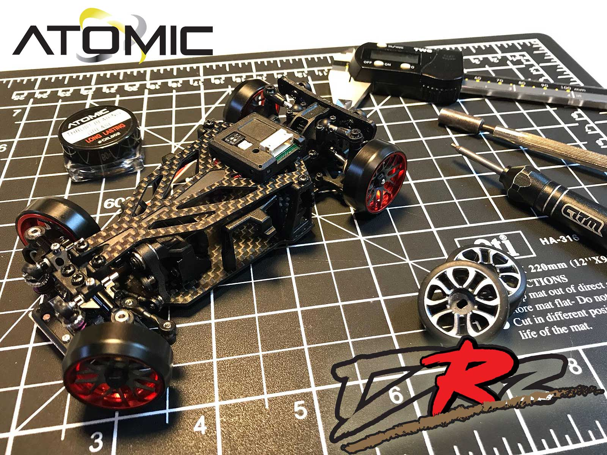{ width="500" }

- On January 6, 2018, Atomic officially announced the DRZ on Facebook.

- Sales began in March.

For the first time, small-scale drifting had a dedicated RWD chassis available to the public.

---

## 2018 Some hobbyists started to develop their own DIY RWD and 3D-printed designs

January 13, 2018 — Andi Capitt presents a MINI-Z RWD kit:

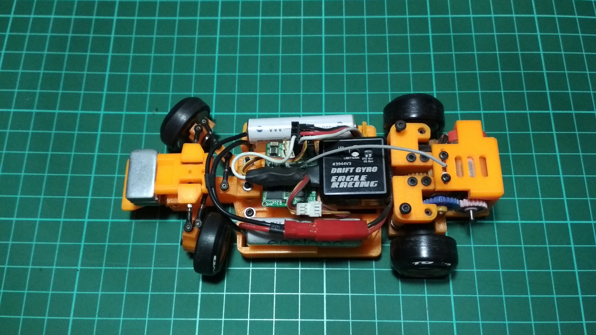{ width="500" } 

Released just days after the DRZ announcement, it showcased an impressive feature set for the time — full geometry adjustability, thoughtful steering design, and clear influence from larger-scale drift concepts.

July 26, 2018 — Pebysetyana posts early prototype designs:

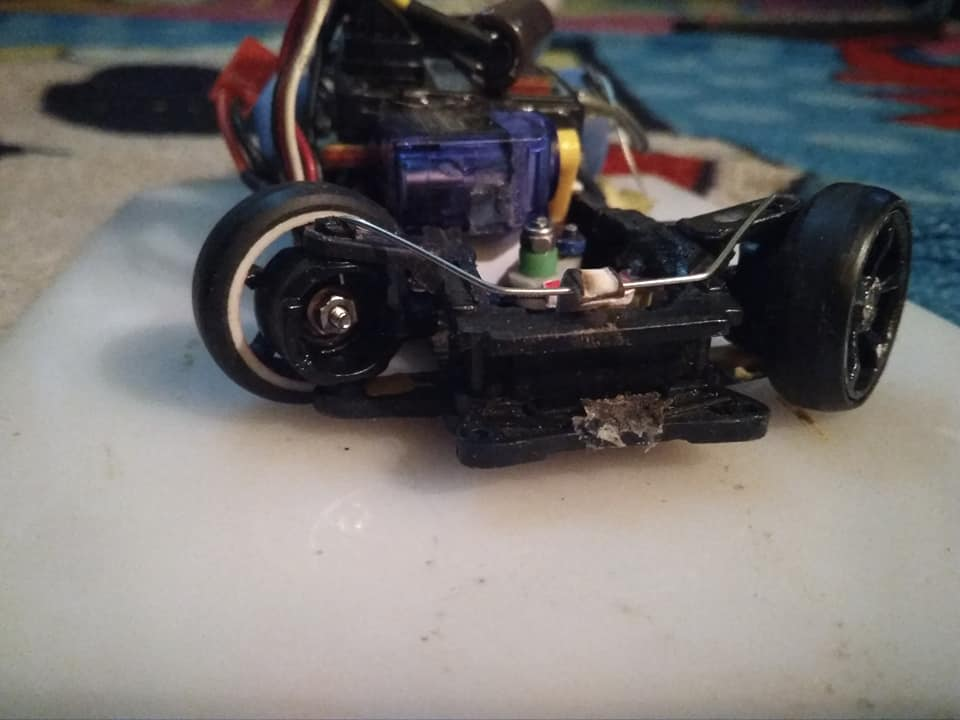{ width="500" }

Later, in October 2018, he introduces the BRP:

{ width="500" }

And in December 2018, the second-generation BRP V2 appeared. It gained strong regional popularity and demonstrated how community-driven development could rival commercial platforms.

{ width="500" }

Meanwhile, more and more RWD DIY conversions and experiments for the WLToys K989 began appearing.

---

## May 2019 XRX Techstorm DPA

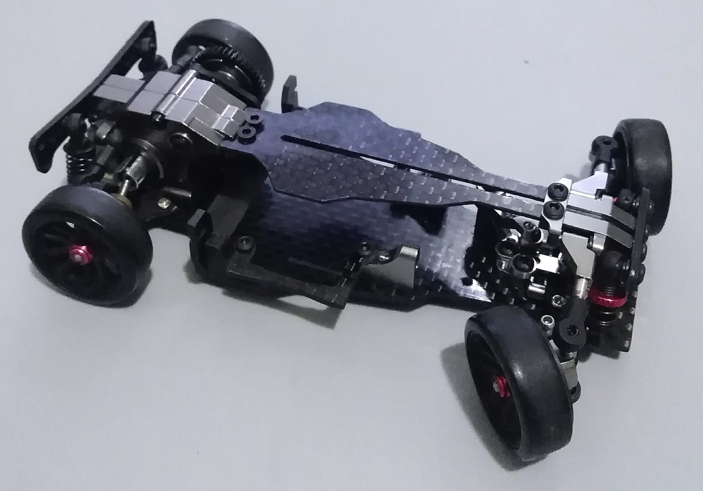{ width="400" }

XRX entered the scene aggressively. Instead of focusing only on a chassis, they launched branded electronics alongside a full lineup of high-end option parts machined from 7075-T6 anodized aluminum.

This marked a shift: small scale was no longer just about experimentation — it was becoming a proper aftermarket ecosystem. 

---

## June 2019 Super Skeeter conversion and BM Racing option parts for Atomic DRZ

{ width="500" } 

On May 31, Atomic announced an upcoming DRZ conversion developed by Super Skeeter, with Atomic handling distribution.

Just days earlier, on June 10, BM Racing had already posted CNC-machined option parts for the DRZ platform.

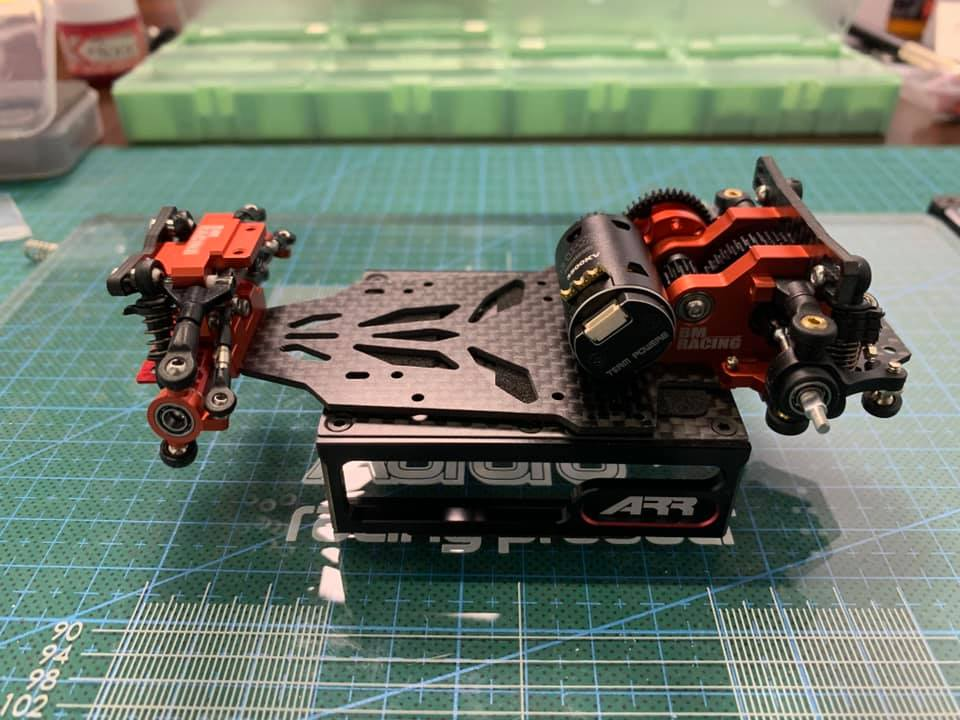{ width="500" }

On June 12, 2019, the Super Skeeter was released, offering:

- direct-drive steering

- wheelbase adjustment 

- quick caster adjustment

- quick Ackermann adjustment 

It quickly became one of the most recognizable DRZ-based builds of the era.

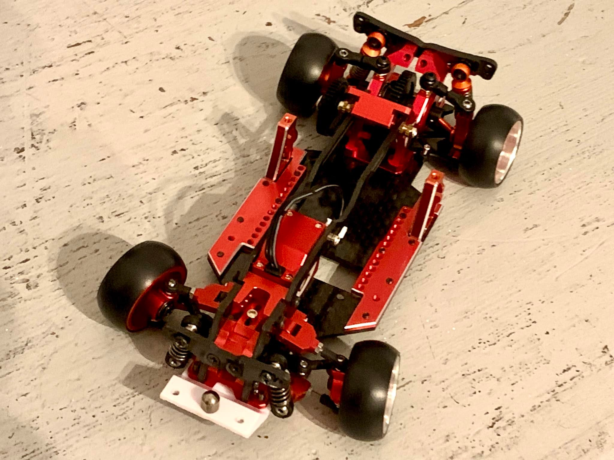{ width="500" }

---

## August 2019 - BRP V3

The third iteration of the BRP arrived — more refined, more visually striking, and widely appreciated both in Indonesia and overseas.

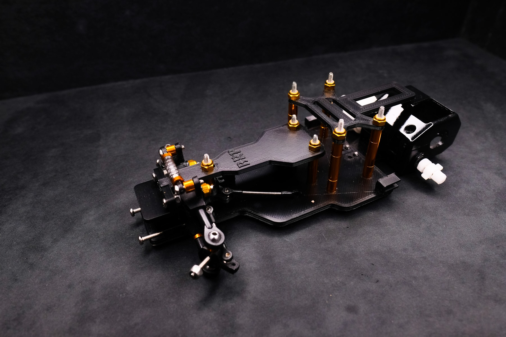{ width="500" }

---

## September 2019 - DriftArt

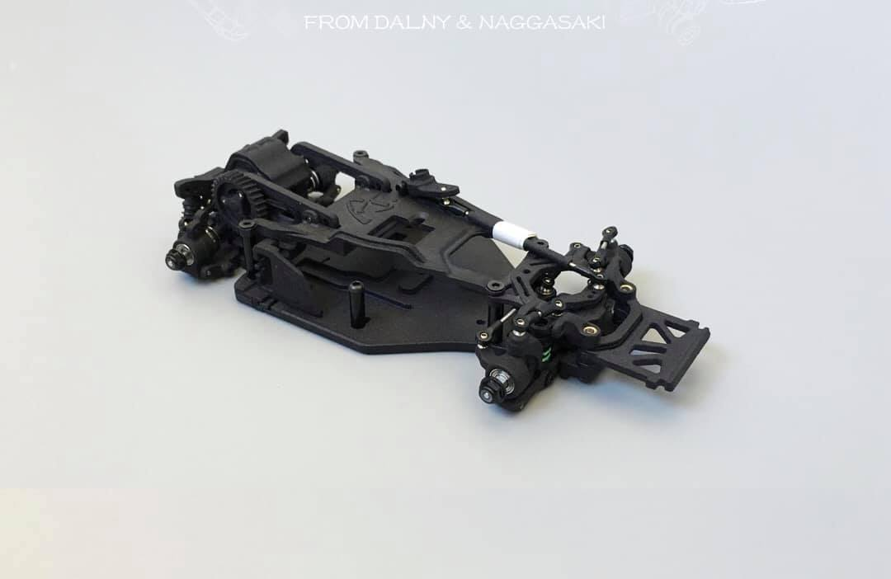{ width="500" }

By September 2019, the main figures of the small-scale RWD scene were already established. Then DriftArt appeared.

Developed by Mr. Chen, DriftArt stood apart immediately. Its ultra-low profile — reminiscent of an F1 car — and nylon 3D-printed construction were unlike anything else on the market at the time.

The design focused on minimalism, low center of gravity, and visual realism. MINI-Z bodies could be mounted in a way that completely concealed the chassis underneath.

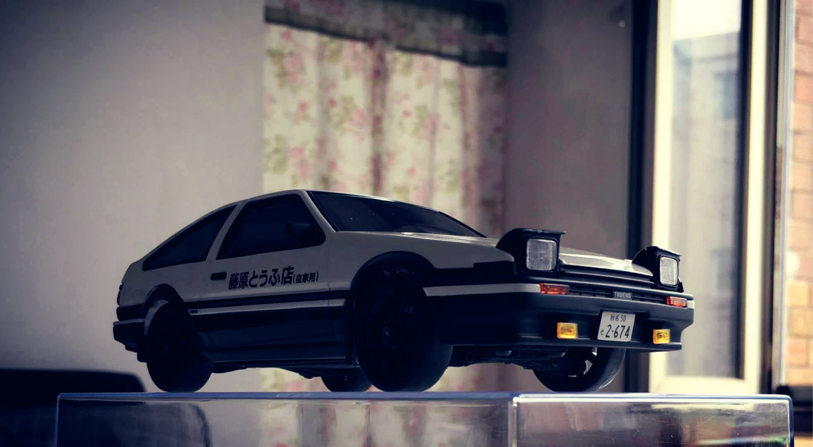{ width="500" }

From a technical standpoint, the first generation DriftArt offered an impressive set of solutions:

- helical gears

- a wide range of ride height adjustments

- telescopic CVDs

- multiple components assembled using a mortise and tenon system, allowing adjustment and disassembly without the need for tools

- support for direct installation of a standard MINI-Z body mount

- an integrated universal body mount, providing more adjustability

Approximately 200 units were produced and sold exclusively in China, which further contributed to its almost mythical status among collectors and early enthusiasts.

Despite its limited availability, DriftArt clearly demonstrated the direction in which small scale RWD drifting was evolving — bold design choices, innovative technologies, and an uncompromising pursuit of optimal geometry.
This first generation laid the foundation for later DriftArt versions, which would go on to become some of the most influential chassis in the history of small scale RWD drifting.

What makes the DriftArt even more remarkable is that, in at least one well-known case, a long-time DriftArt collector — owning nearly every DriftArt component ever produced — openly expressed willingness to purchase a DriftArt 1 for $1,000, yet was still unable to acquire one.

As of today, it is believed that all surviving DriftArt 1 chassis remain in China, held by private collectors, further emphasizing their extreme rarity and almost inaccessible status.

---

## October 2019 - HGD1 and PWK

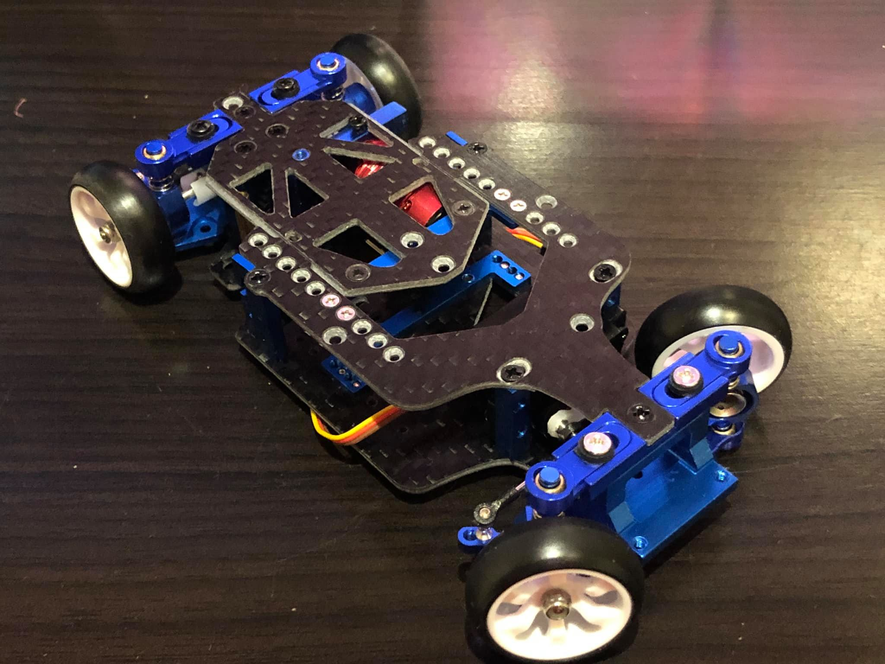{ width="500" }

HGD1 wasn’t technologically groundbreaking or visually striking, but it was metal/carbon, wheelbase-adjustable, and available worldwide. RTR packages — including electronics, controller, and diecast body — were reportedly available around $250, lowering the barrier to entry for newcomers.

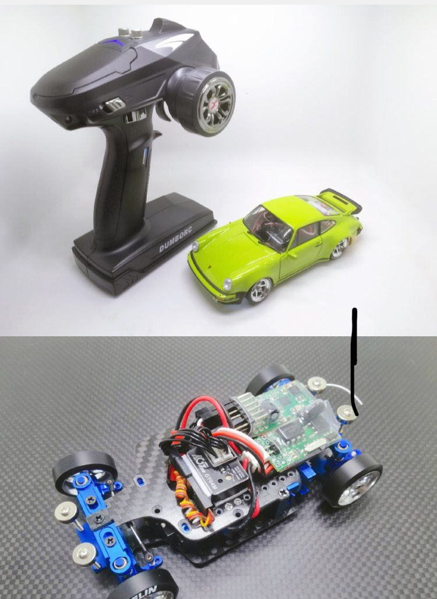{ width="500" }

---

In parallel, PWK, designed by Pur Woko, emerged from Indonesia. Its distinctive dual-color 3D-printed design caught attention, and Indonesian driving videos continued to captivate the global community.

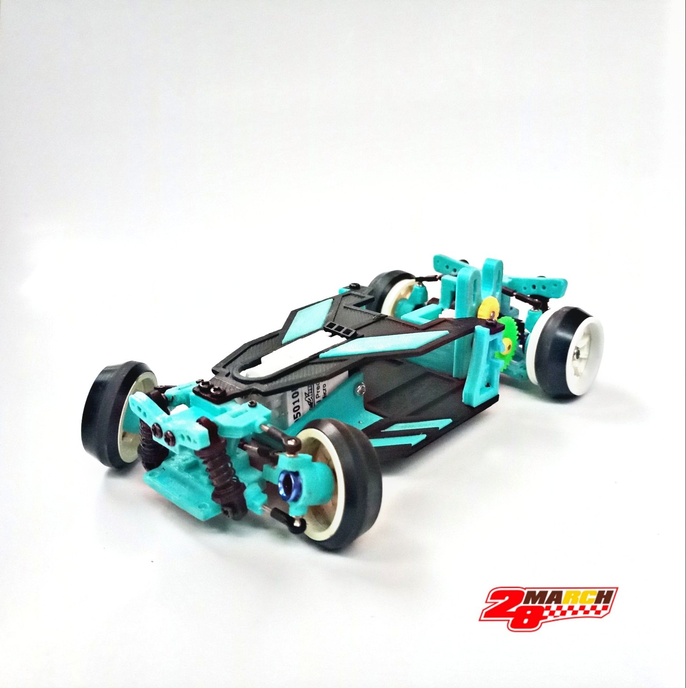{ width="500" }

---

## November 2019 - TRC

{ width="500" }

TRC V1, developed by Tommy RC, represents one of the most ambitious and mysterious designs of the pre-COVID era.

Limited to just 30 units — 15 pink and 15 purple — it remains one of the rarest small-scale RWD chassis ever produced.

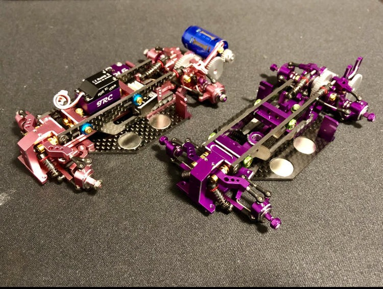{ width="500" }

Its engineering was unusually complex, featuring active caster up front and a dynamically linked rear toe system tied to steering input.
This level of mechanical complexity was virtually unheard of in small scale RWD designs at the time.

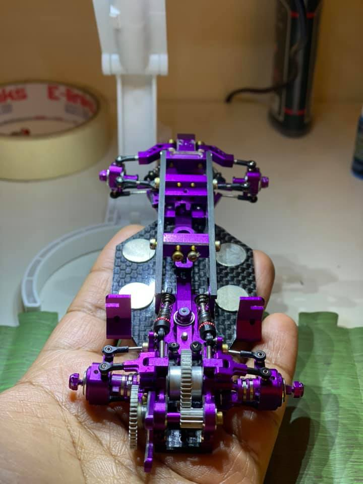{ width="500" }

Due to its extremely limited production and lack of official documentation, TRC V1 remains largely undocumented and almost unseen outside of China. Its rarity, combined with its bold engineering choices, has given TRC V1 an almost mythical status within the small scale RWD drift community.

Details reported by a documented owner include an adjustable wheelbase ranging from 90 to 120 mm. The same owner has stated that the chassis was manufactured in Japan, though this has not been confirmed.

Rather than influencing the scene through widespread adoption, TRC V1 stands as a peak example of late-2019 experimental design — a chassis that pushed mechanical ideas to their limits just before small scale RWD drifting entered its next phase of rapid global expansion.

---

## November 2019 - Nero

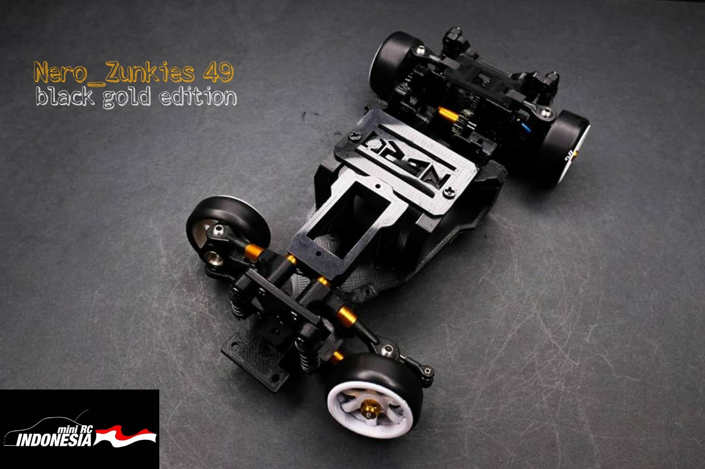{ width="500" }

Another Indonesian 3D-printed design followed: NERO_ZUNKIES 49, created by Nockizz Ardian Troy — yet another sign of how quickly the scene was expanding.

---

## January 2020 - BMR-X and PWK V2

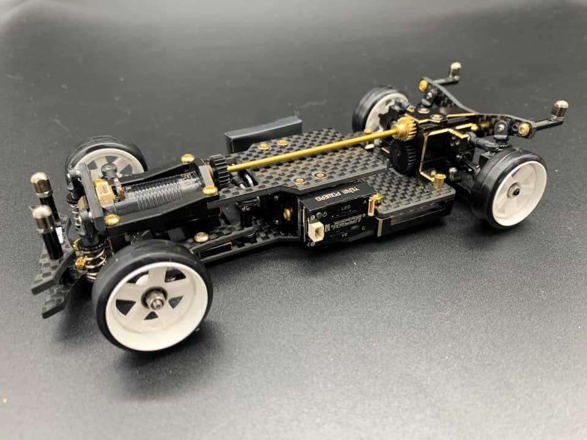{ width="500" }

BM Racing transitioned from DRZ option parts to their own chassis: BMR-X.

Their strategy was different. They released the fully upgraded VIP version first.
The VIP version was the most expensive small scale kit at the time, and you could get one for $429. It was not MINI-Z 1:28 scale, but 1:24 and offered with magnet mounting body posts, adjustable offset wheels, suitable for 1:24 model kit bodies. Another unique feature for the small-scale scene was its RWD layout with a front-mounted motor.

Later, they announced the BMR-X Standard edition, which would be available from June, priced at $135.

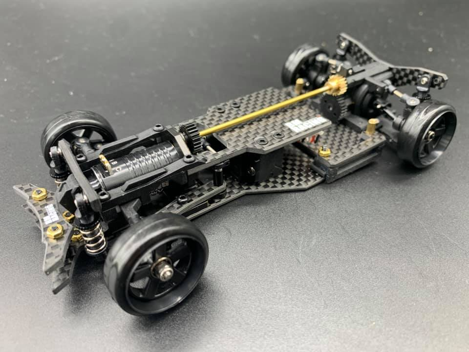{ width="500" }

---

Second version of the PWK chassis was released, offered in two color trim again.

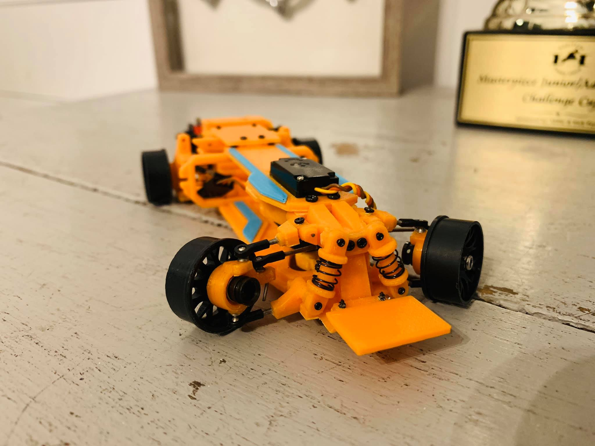{ width="500" }

Later he implemented an important upgrade, refining the design with slimmer decks, which suits even today's standard.

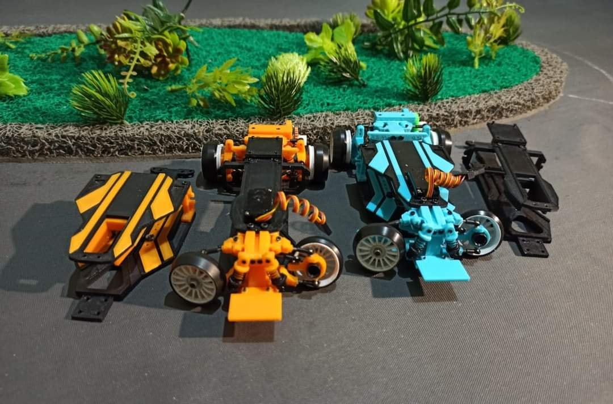{ width="500" } 

---

## COVID-19 and the boom of home drifting

When the COVID-19 pandemic hit in 2020, nearly all drift tracks closed overnight.

For 1/10 scale drifting, it was a setback.
For small scale, it became an unexpected accelerator.

Home layouts, DIY tracks, and online communities exploded — and small-scale RWD drifting transformed from a niche experiment into a global movement.

---

## Conclusion

Small-scale RWD drifting didn’t appear overnight.

It grew from experimentation, shared knowledge, bold design decisions, and a community willing to push boundaries — long before it became accessible or popular.

This story isn’t just about chassis.
It’s about people, curiosity, and a scene that built itself from the ground up.